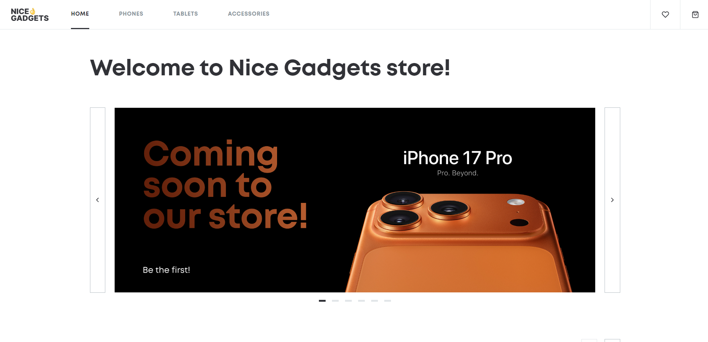
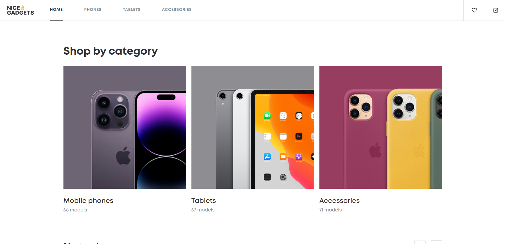
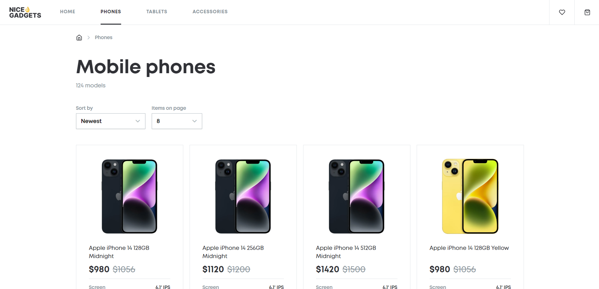
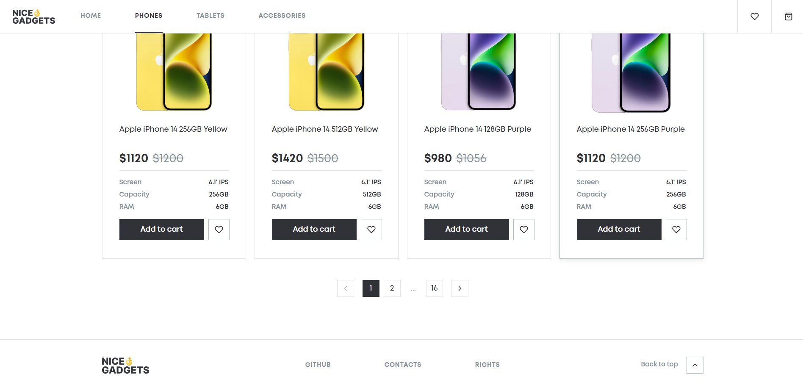
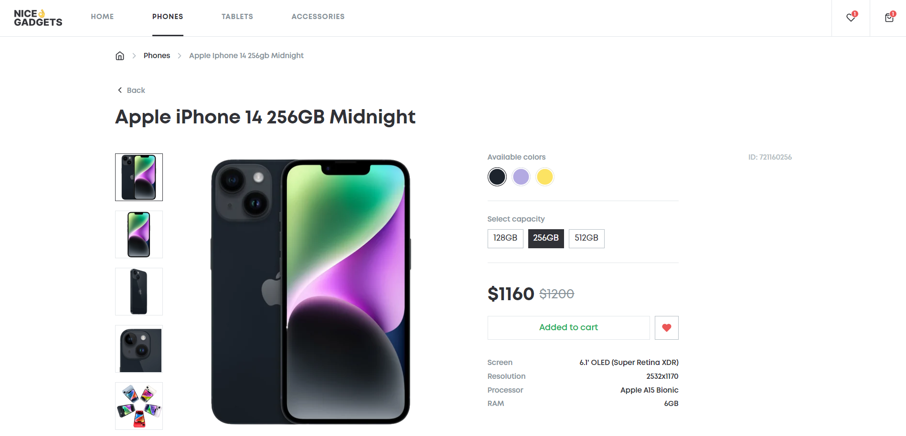
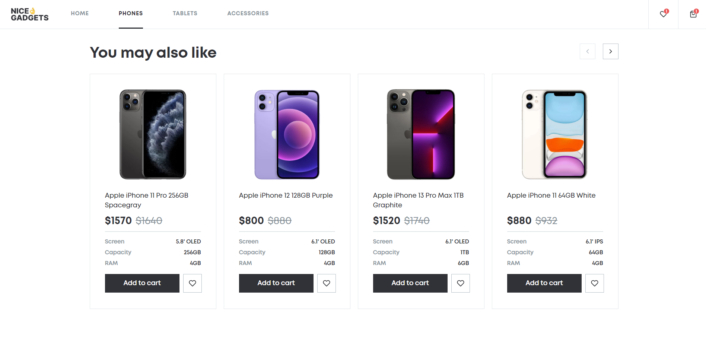
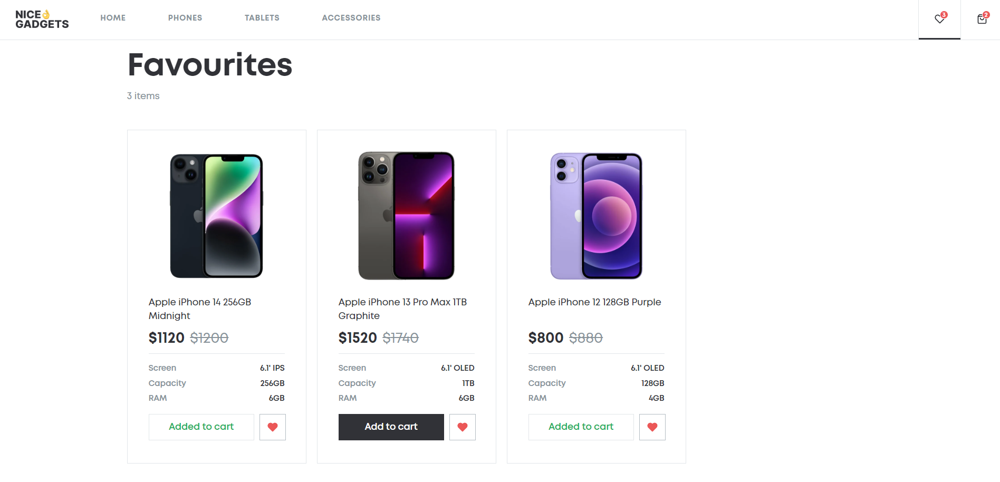
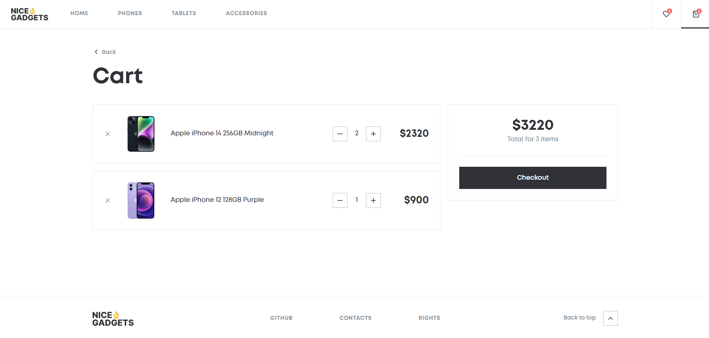

# Mobile Store App

A responsive phone catalog built with React.
The application allows users to browse products, view details, and explore different phone categories.

## 📱 Demo

👉 Try it here: [Mobile Store Demo](https://alyonashunevych.github.io/mobile-store-app/)

## 📸 Screenshots

### 🏠 Home Page
- Welcome page with navigation to categories like Phones, Tablets, and Accessories




### 🗂️ Category Page
- Sort products, set the number of items per page, and use pagination to browse all items




### 📱 Product Page
- View product images, specifications, and details. Add to cart or favorites. See related products carousel




### ❤️ Favourites Page
- Check all the products you’ve marked as favorites



### 🛒 Cart Page
- Review selected products, see total price, and proceed to checkout (logic not implemented)



## 🛠️ Tech Stack

* React + TypeScript
* SCSS
* React Router
* Redux Toolkit
* Vite (build tool)

## ✨ Features

* Product catalog **pagination** and **sorting**
* Choose **number of items per page**
* Product details page
* Add products to **cart**
* Mark products as **favorites**
* State management with Redux
* Responsive design (mobile → desktop)

## 🚀 Run locally

```bash
git clone https://github.com/alyonashunevych/mobile-store-app.git
cd mobile-store-app
npm install
npm start
```

## 📌 Notes

This project is frontend-only. Some features like checkout are not implemented.

## 👤 Author

https://github.com/alyonashunevych
